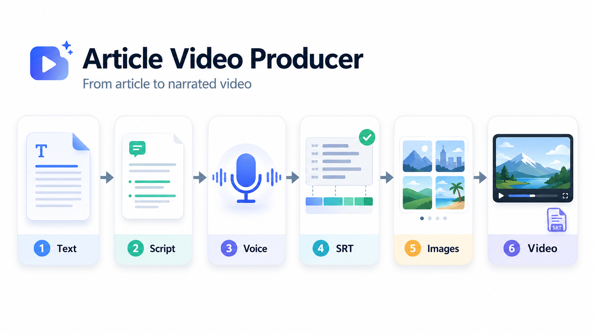
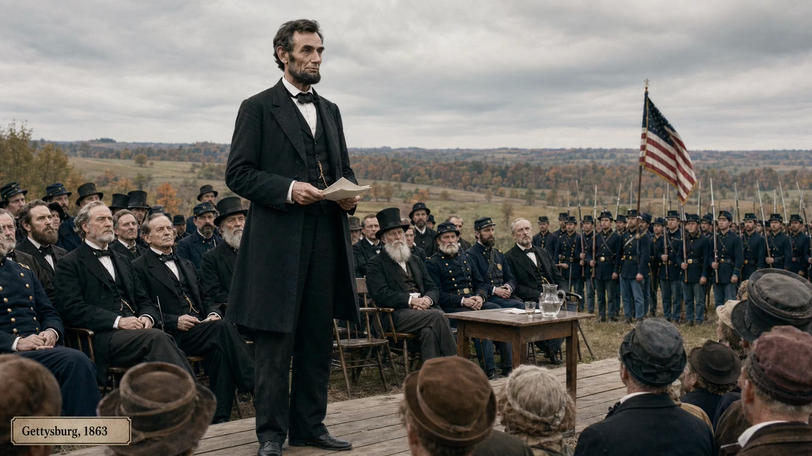

# Article Video Producer



Turn an article, essay, or Markdown note into a narrated video package: spoken script, AI voiceover, sidecar SRT subtitles, generated images, and a final MP4.

## What It Does

- Rewrites long-form text into a more natural spoken script while preserving the original structure and style.
- Generates narration with Qwen3-TTS.
- Supports either cloning your own permitted voice or using a built-in model voice.
- Lets the AI adjust tone, pacing, and emphasis from the meaning of the article when using model voices.
- Creates external `.srt` subtitles, not burned-in captions.
- Plans documentary-style images, generates scene visuals, and renders the final video.
- Pauses for review after the spoken script and again before image generation.

## Sample

Click the preview to watch the Gettysburg Address sample video:

<a href="https://github.com/rufuszhu/Text-to-Video-Skill/releases/download/v1.0/final_model_voice.mp4">
  
</a>

- [Download the sample SRT](https://github.com/rufuszhu/Text-to-Video-Skill/releases/download/v1.0/final_model_voice.srt)
- Source text: [`samples/gettysburg-address.md`](samples/gettysburg-address.md)

GitHub README pages do not reliably render Release MP4 files as inline video players, so this README uses a clickable preview image.

## How To Use

Install the skill by copying this folder into your agent skills directory:

```bash
mkdir -p ~/.agents/skills
cp -R article-video-producer ~/.agents/skills/article-video-producer
```

Then ask Codex in plain language:

```text
Use the article-video-producer skill to turn my article into a video using my own voice.
```

Or:

```text
Use article-video-producer to make samples/gettysburg-address.md into a narrated video. Use a model voice and let the AI choose the right emphasis.
```

For voice cloning, provide a clean 30-90 second reference recording and an exact transcript. Only clone voices you own or have explicit permission to use.

## Outputs

Each run creates a fresh folder under:

```text
<VaultRoot>/video/<article-stem>-video/
```

The main deliverables are:

```text
video/final.mp4
video/final.srt
```

## License

MIT. See [`LICENSE`](LICENSE).
