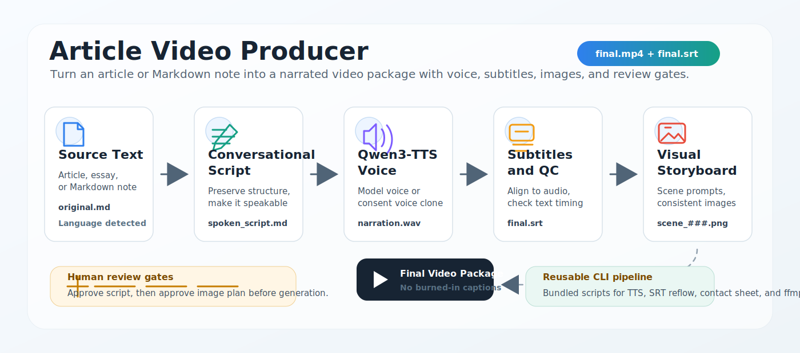

# Article Video Producer



`article-video-producer` is an AI-agent skill for turning a long-form article or Markdown note into a narrated video package:

- lightly conversational spoken script
- Qwen3-TTS narration, using either built-in model voices or consent-based voice cloning
- external `.srt` subtitles, not burned into the MP4
- documentary-realistic AI image prompts and generated scene images
- image contact sheet for quick visual review
- ffmpeg-rendered final video with static images by default, plus optional ultra-slow pan/zoom

The skill is designed for Codex-style agents that can read local files, call image generation tools, run shell commands, and pause for human review.

## Demo

Repository:

- [rufuszhu/Text-to-Video-Skill](https://github.com/rufuszhu/Text-to-Video-Skill)

Recommended public-domain sample source:

- [`samples/gettysburg-address.md`](samples/gettysburg-address.md)

Why this sample works well:

- it is short
- it is public domain
- it is widely recognizable
- it has a clear emotional and historical arc
- it renders as a roughly two-minute documentary-style video

Sample release assets:

- [Watch the sample video](https://github.com/rufuszhu/Text-to-Video-Skill/releases/download/v1.0/final_model_voice.mp4)
- [Download the sample SRT](https://github.com/rufuszhu/Text-to-Video-Skill/releases/download/v1.0/final_model_voice.srt)

The sample MP4 and SRT are hosted as GitHub Release assets rather than committed directly to the repository.

## How It Works

The workflow has two mandatory human review gates:

1. The agent writes `script/spoken_script.md`, then stops for user review.
2. The agent writes `images/visual_entities.md`, `images/style_guide.md`, `images/image_plan.md`, and `images/image_prompts.json`, then stops for user review.

After images are generated, the agent creates a contact sheet so the user can quickly check whether people, style, and generated text look reasonable before the final render.

Final subtitles are always sidecar subtitles:

```text
video/final.mp4
video/final.srt
```

The MP4 should contain video and audio only.

Static images are the default render mode. Optional pan/zoom is available, but should be used only when a test render looks smooth.

## Output Structure

Each run creates a fresh project folder:

```text
<VaultRoot>/video/<article-stem>-video/
```

Typical contents:

```text
<article-stem>-video/
|-- script/
|   |-- original.md
|   |-- spoken_script.md
|   |-- spoken_script.txt
|   `-- narration_segments.json
|-- audio/
|   |-- voice_reference/
|   |-- narration.wav
|   |-- narration_normalized.wav
|   `-- segments_manifest.json
|-- subtitles/
|   |-- transcript_raw.srt
|   |-- subtitles_aligned.srt
|   `-- subtitle_qc.md
|-- images/
|   |-- visual_entities.md
|   |-- style_guide.md
|   |-- image_plan.md
|   |-- image_prompts.json
|   |-- contact_sheet.html
|   |-- contact_sheet.png
|   `-- scene_###.png
|-- video/
|   |-- timeline.json
|   |-- final.mp4
|   `-- final.srt
`-- production_notes.md
```

## Requirements

Core tools:

- Python 3.10-3.12
- ffmpeg and ffprobe
- Qwen3-TTS
- stable-ts, with faster-whisper as fallback
- OpenAI/ChatGPT image generation or an equivalent image generation tool

Python packages commonly used by the bundled scripts:

```bash
python -m pip install -r requirements.txt
```

For agent-oriented setup instructions, see [`AGENT_SETUP.md`](AGENT_SETUP.md).

## Choosing A Voice

The narration helper supports two normal paths:

1. Use a built-in model voice when the user does not provide a voice reference.
2. Use voice cloning when the user provides a permitted reference recording and exact transcript.

Model voice example:

```bash
python scripts/generate_qwen_narration.py \
  --project <project-folder> \
  --voice-mode model \
  --speaker eric \
  --model-id Qwen/Qwen3-TTS-12Hz-1.7B-CustomVoice \
  --instruct "Read with a solemn, documentary narration style." \
  --hf-cache <VaultRoot>/article-video-setup/model-cache/huggingface
```

Voice cloning example:

```bash
python scripts/generate_qwen_narration.py \
  --project <project-folder> \
  --voice-mode clone \
  --ref-audio <project-folder>/audio/voice_reference/reference.wav \
  --ref-text <project-folder>/audio/voice_reference/reference.txt \
  --model-id Qwen/Qwen3-TTS-12Hz-1.7B-Base \
  --hf-cache <VaultRoot>/article-video-setup/model-cache/huggingface
```

`--voice-mode auto` is the default: it uses clone mode when both reference files exist, otherwise it uses a built-in model voice. For expressive delivery with model voices, pass `--instruct` or a per-segment `--delivery-plan` JSON file.

## Install As A Skill

Copy this directory into your agent skills directory, for example:

```bash
mkdir -p ~/.agents/skills
cp -R article-video-producer ~/.agents/skills/article-video-producer
```

Then ask the agent to use `article-video-producer` on a Markdown article.

Example:

```text
Run article-video-producer on samples/gettysburg-address.md.
Use a 16:9 YouTube-style format.
Use Qwen3-TTS narration.
Keep subtitles external as final.srt.
Pause for review after the spoken script and again after the image plan.
```

## Bundled Scripts

The skill includes reusable scripts so future runs do not need to create one-off helpers:

| Script | Purpose |
|---|---|
| `scripts/build_narration_segments.py` | Build narration segment JSON and plain script text. |
| `scripts/generate_qwen_narration.py` | Generate Qwen3-TTS narration in chunks and write a timing manifest. |
| `scripts/reflow_srt.py` | Clean and reflow SRT subtitles, then copy `video/final.srt`. |
| `scripts/make_contact_sheet.py` | Build an HTML and optional PNG image contact sheet. |
| `scripts/render_video.py` | Render the final MP4 with external subtitles only. |

Use scripts through Python:

```bash
python scripts/render_video.py --project <project-folder>
```

The files may not have executable permissions after copying, so `python scripts/...` is the safest invocation style.

## Voice Cloning Safety

Only clone voices with clear permission:

- your own voice
- a collaborator's voice with explicit consent
- a voice sample created specifically for this use

Do not clone public figures or private people without consent. Do not commit private voice references to a public repository.

## License

MIT. See [`LICENSE`](LICENSE).

## Repository Hygiene

Before publishing:

- confirm the MIT license owner and year are correct
- keep API keys out of the repository
- do not commit model caches
- do not commit private voice reference audio
- avoid committing large generated MP4s directly; prefer GitHub Releases or an external host
- include one short public-domain sample source

## Sample Ideas

Good demo texts should be public domain, short, English, and recognizable. Strong candidates:

- `The Gettysburg Address` by Abraham Lincoln
- `The Declaration of Independence`, excerpt only
- `A Room of One's Own`, short public-domain excerpt where available in your jurisdiction
- `Self-Reliance` by Ralph Waldo Emerson, short excerpt
- `On Liberty` by John Stuart Mill, short excerpt

This repository uses the Gettysburg Address as the default sample because it is compact and easy to verify.
